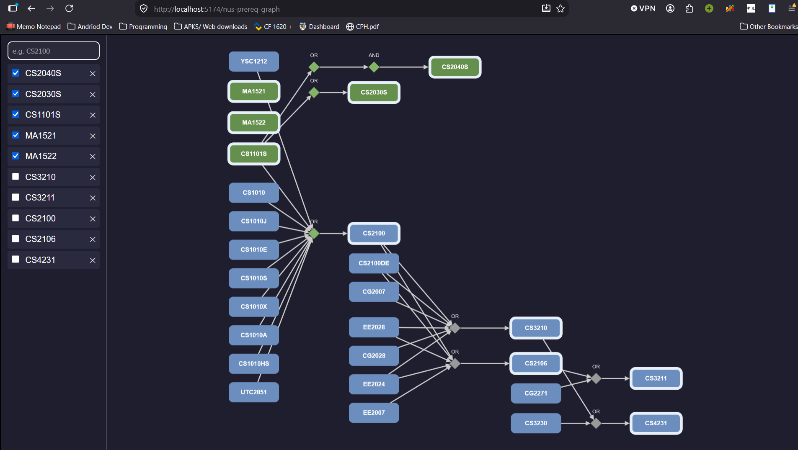

## NUS module pre-requisite graph 

Made to trace the entire pre-requite chain needed to complete a set of mods, or specialization planning (ie. one or more focus areas in CS)

API taken from NUS MODS 

Demo: a student interest in Parallel Computing focus area

#### usage
- search mods by code in the side bar and press enter
- In the graph, searched mods have a white border, mods without borders are added due to being pre-req
- click checkbox in the sidebar of a mod to mark it as "completed". Alternatively, click the mod on the graph will toggle its "completed" status as well.
- completed mods are in green in the graph
- logic gates (diamond) will be marked in green if fulfilled
- does not show required grades yet 
- does not show preclusions 
- automatically simplify tree and hides pre-requisites if a mod is completed
